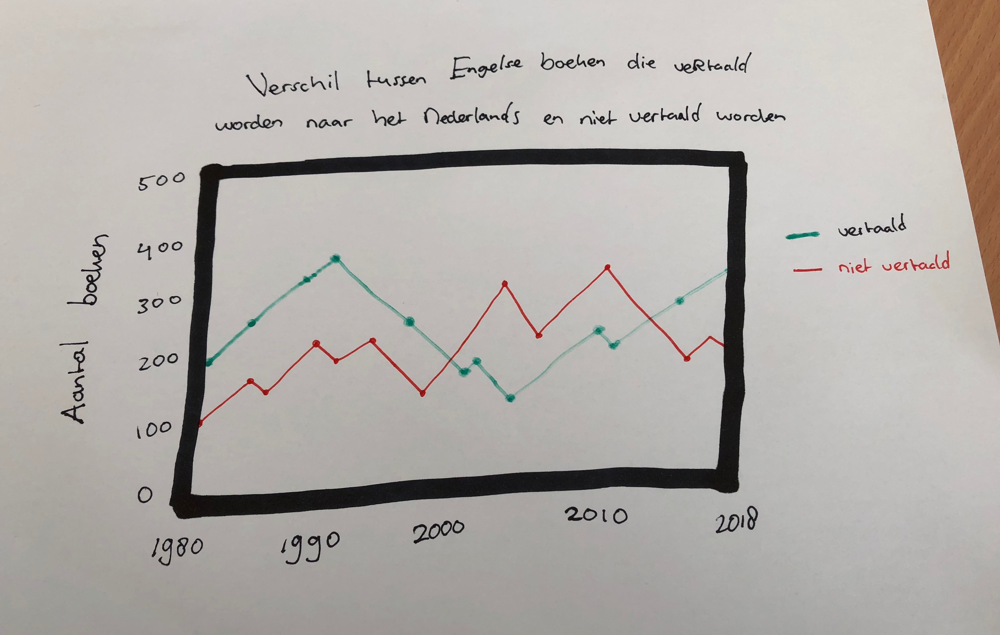
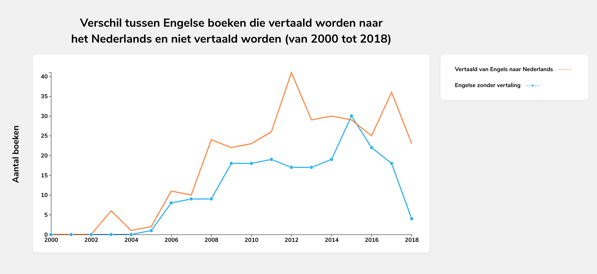

# Impact of better control of the English language in the Netherlands on translations of English books into Dutch

**Since 1986, a great deal of attention has been given to the English language in our country. English was then obligated in group 7 and 8 of primary school. In the Dutch media we also encountered the English language more and more, especially on television and radio. A recent study by language education agency EF Education shows that Dutch people have better control of the English language than other countries that do not use English as their mother tongue. In general, Dutch people have become good at English and many English speaking people moved to The Netherlands. So does it impact the translations of English books into Dutch?**

## Main question
What is the impact of better control of the English language on translations of English books into Dutch?

### Hypothesis
Better control of the English language ensures that fewer books are translated from English into Dutch

### Required variables
* Original language
* Languages
* Publication year
* Format

## Research
To link data to the required variables, we use data from the Amsterdam Public Library (Openbare Bibliotheek Amsterdam, OBA)

### Retrieve data from the OBA API
[Rijk van Zanten](https://github.com/rijkvanzanten) has written a [tool](https://github.com/rijkvanzanten/node-oba-api) to extract and convert data from the OBA API to JSON. I have modified the tool so that the results of a search term are prettified and written to a .json file. I then retrieved all the keys and based the available data on it.

#### Available data

* Title
* Short title
* Subtitle
* Main author
* Author
* Format
* Publisher
* Description
* Language
* Original language
* Genre
* Characteristics
* Cover
* ISBN
* SISO
* Publication year
* Topic
* Edition
* Series
* Target audience

### Searching through data
Folkert and Dennis adapted Rijk's tool to make the tool more passable. That's why I first made the switch to the tool that they adapted. However, I didn't gain much from it. Gijs convinced me to write it myself, because then I would know how it worked, understand the code, and change it to however I would want it to work.

But damn, I got sick, and missed two days. Now it's the next week and I still don't have the data that I want, and we were supposed to be working in D3 already! That is when I asked Gijs for help and we sort of decided to work on the project together, since we were both behind. What's first? I know the data that I want, so we decide to work on retrieving the data first.

1. First, I want to change my search query to something specific. I only want to retrieve BOOKS, not magazines or whatever. So I look through the [Aquabrowser API Documentation](https://zoeken.oba.nl/api/v1/) and find out that I can do that by changing the facet to *Type(book)*, and put refine on true.
```javascript
const search = {
  endpoint: 'search',
  query: {
    q: 'book',
    facet: 'Type(book)',
    refine: true,
    pagesize: 20
  }
}
```

2. Alright, we got some data. Now we have to filter out all the data that we don't need. So we map through the (retrieved) data and format it to data that we need and afterwards can easily access. Dennis came up with the idea to format it like this, Gijs wrote the code and I cleaned it up and resolved some errors, because it was quite dirty at first.

```javascript
let result = response.data.map(book => {
  return {
    format: book.formats[0].format[0]['_'],
    publication_year: book.publication && book.publication[0].year && book.publication[0].year[0]['_'] ? book.publication[0].year[0]['_'] : null,
    language: book.languages ? book.languages[0].language[0]['_'] : null,
    ['original-language']: book.languages && book.languages[0] && book.languages[0]['original-language'] ? book.languages[0]['original-language'][0]['_'] : null
  }
})
```

3. The last thing we have to do is filter the retrieved books. We only want books which are English and books which are translated from English to Dutch. I created two variables called books and translatedBooks, mapped through all the results, and then pushed all the books to the regarding variable.

```javascript
let translatedBooks = [];

result.map(book => {
  if (book.language === 'dut' && book['original-language'] === 'eng') {
    translatedBooks.push(book)
  }
})
```

4. We now have the results that we want. We can create a JSON file where the results will be written to.

```javascript
fs.writeFile ("results.json", JSON.stringify(translatedBooks), function(err) {
  if (err) throw err
})
```

5. We still get a huge list with data. We only need the AMOUNT (length) of books and translated books per publication year. Also, we don't want to mess up our graph because of one book that was published in 1860 or something like that. We want to search between 1986 and 2018. Gijs wrote a for loop for this where he pushed all the books that belonged to a year into two arrays (because there are two variables, books and translatedBooks). He then pushed all the results back to one array, with the length of books and translatedBooks beloning to a year. So all credits go to Gijs for this.

5. Lets take a look at the JSON file (I made it shorter just for this readme, in reality it's between 1986 and 2018). We retrieved the year, the amount of english books it has, and the amount of english books that are translated to dutch.

```json
[
  { "year": "2015", "english": "355", "englishToDutch": "303" },
  { "year": "2016", "english": "279", "englishToDutch": "249" },
  { "year": "2017", "english": "265", "englishToDutch": "230" },
  { "year": "2018", "english": "166", "englishToDutch": "158" }
]
```

5. There is one last step... We want to search through ALL the books. However, we are limited by the API, it only shows 20 results. Gijs and me looking into retrieving more results by pagination. Lets say we have 200 results, that would mean we get 10 pages of results. We could then combine all results and show it on one page. Folkert and Dennis also thought about this and wrote some code for it, I implemented it and it worked. All results were combined, cool. We are still limited though, because after 29 pages of results, the API times you out. Anyhow, 580 results is better than 20.

EDIT: Gijs added a delay of one second after each request, which allowed us to get 200 pages of results. That's data based on 20000 books. NICE!

#### Visualize data

So, I helped out with a lot of thinking and doing research to retrieve the data that I want, but I didn't write much of the code myself. Time to play with the data in D3 and show my own powers.

1. First, I sketched a quick design to show the data in a line graph. I figured lines would be easliy readable and a good starting point with D3.



2. I read a bit of the documentation of the D3 library and afterwards look for examples. I quickly find a lot of helpful articles which explain D3 quite well. I create a index.html file and implement the D3 library.

3. I first want to set the dimensions of the graph and add some margins

```javascript
const margin = {top: 50, right: 50, bottom: 50, left: 50},
width = 1100- margin.left - margin.right,
height = 550 - margin.top - margin.bottom
```

4. Then I set the ranges of the xAsis and yAsis and define the two lines that I want to show

```javascript
let x = d3.scaleTime().range([0, width])
let y = d3.scaleLinear().range([height, 0])

// define the amount of english books that are translated to dutch
let line = d3.line()
 .x(function(d) { return x(d.year) })
 .y(function(d) { return y(d.english) })
```

5. We set the SVG and append it to svg and give it it's attributes. Now it's time to create a function where we will retrieve the data from the json file. In d3 it's really simple. We can use the code beneath to retrieve the data and use it in a function called draw

```javascript
d3.json("results.json", function(error, data) {
  if (error) throw error
  draw(data)
})
```
7. Inside the function we format the data and then scale the range of the data.

```javascript
x.domain(d3.extent(data, function(d) { return d.year }))
y.domain([0, d3.max(data, function(d) {return Math.max(d.english, d.englishToDutch) })])
```

8. We set both line paths, the xAsis, the yAsis and set a circle for each year based on the amount of books datapoint.

```javascript
// Add the line
svg.append("path")
  .data([data])
  .attr("class", "line")
  .attr("d", line)
// Add the X Axis
svg.append("g")
  .attr("transform", "translate(0," + height + ")")
  .attr("class", "text")
  .call(d3.axisBottom(x))
// Add the Y Axis
svg.append("g")
  .attr("class", "text")
  .call(d3.axisLeft(y))
// sets a circle for each year on height of amount english books
svg.selectAll(".dot")
  .data(data)
  .enter().append("circle")
  .attr("class", "dot")
  .attr("cx", function(d) { return x(d.year)})
  .attr("cy", function(d) { return y(d.english)})
  .attr("r", 5)
```

8. After cleaning up and making some design changes, we get out first result!


